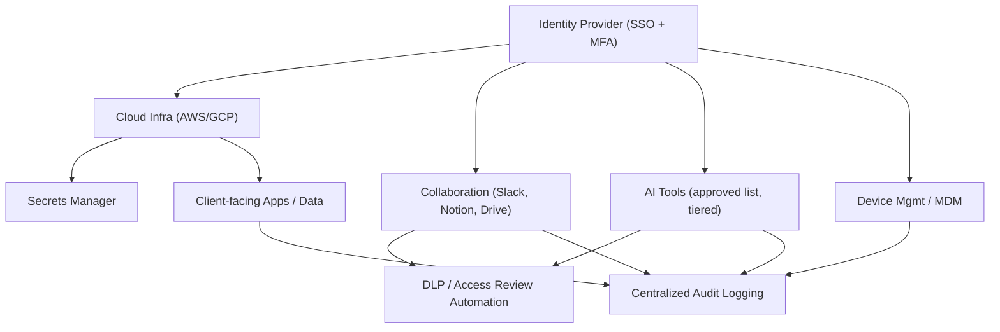

# Ajaia AI-Native IT Manager Assessment
Prepared for: Ajaia LLC · Reference: [ajaia.ai](https://ajaia.ai)

---

## Task 1: Live IT Incident Response

### 1A. Immediate Response (0–2 Hours)

**Priority order and why:** an actively exploitable secret is the only issue with a live blast radius — everything else is a standing risk, not an emergency. Fix the bleeding first, then triage.

1. **Revoke/rotate the exposed API key immediately** in the provider console — this stops exploitation regardless of how it leaked.
2. **Check usage/billing logs** for the key since exposure to spot anomalous calls (unexpected volume, new IPs, unfamiliar regions).
3. **Identify the exposure vector** (git commit, Slack message, shared doc, screenshare) — determines what else needs cleanup.
4. **Scrub the secret from history**: if committed to git, purge with `git filter-repo`/BFG and force-push; delete/edit the Slack message or doc; assume cached/indexed copies may persist and treat the key as permanently burned.
5. **Rotate any dependent credentials** (webhooks, downstream services using that key).
6. **Log the incident** (time discovered, vector, actions taken) — needed for 1C and any compliance obligations.
7. **No wide announcement yet** — contain first, communicate once the facts are confirmed (see 1B).

### 1B. Short-Term Fixes (24 Hours)

**Access cleanup**
- Pull a full permissions export for Notion and Google Drive; flag anything set to "Anyone with the link" or org-wide edit access.
- Reset default sharing settings to **private/invite-only** at the workspace level.
- Manually review top 20 most-sensitive docs (client data, credentials, HR files) first; broad cleanup follows.

**Risk reduction**
- Inventory all AI tools currently in use (ask each team directly — shadow IT won't show up in SSO logs otherwise).
- Enforce SSO + MFA org-wide as a blocking requirement, starting with admin/finance/HR accounts.
- Stand up a secrets manager (1Password/Vault) and migrate any hardcoded or Slack-shared credentials into it.
- Enable secret-scanning on any code repos (GitHub secret scanning / gitleaks pre-commit hook).

**Communication approach**
- Internal: calm, factual, no-blame message — "we found and fixed X, here's what's changing and why." Blame culture kills future self-reporting of exactly these issues.
- External/client: only escalate if log review confirms actual data access or exposure — loop in legal/leadership before any external notice, since premature disclosure has its own costs.

### 1C. Long-Term Prevention

**System changes**
- Mandatory secrets manager for all API keys/credentials — no exceptions, no docs/Slack storage.
- Pre-commit + CI secret scanning on all repos.
- Automated monthly permission audits (script comparing sharing settings against a private-by-default policy).
- Device management (MDM) for company-issued and BYOD devices touching company data.

**AI tool governance model**
- **Approved-tool list**, tiered by what data class they may touch (see 2C for classification).
- **Intake process**: any new AI tool request goes through a lightweight security review (data handling, training-on-input policy, SOC2/BAA status) before use — target 48h turnaround so it doesn't become shadow IT bait.
- **Central visibility**: admin console/SSO-gated access to all approved tools so usage is auditable.
- **Quarterly review** of the approved list and actual usage vs. policy.

---

## Task 2: AI-Native IT Infrastructure Design

### 2A. Architecture Design

**Core platforms**
- **Identity**: Google Workspace or Okta as the single identity hub — every other system federates through SSO.
- **Cloud**: AWS or GCP for infrastructure, with environment separation (dev/staging/prod) and least-privilege IAM roles.
- **Collaboration**: Slack (comms) + Notion/Drive (docs) — both SSO-gated, default-private sharing.
- **AI tools**: sit behind SSO where possible; tiered by data sensitivity (see 2C).
- **Secrets/config**: centralized secrets manager, never in code or chat.

Everything authenticates through the IdP; every system logs to a central pipeline; data flows into AI tools only after passing the sensitivity gate.

### 2B. Security and Access Control

**IAM structure**
| Tier | Example roles | Access scope |
|---|---|---|
| Admin | IT Manager, Founders | Full infra + billing + IAM control |
| Manager | Dept leads | Full access within their department's systems |
| Employee | Standard staff | Least-privilege, role-scoped access |
| Contractor/Intern | Temp staff | Time-boxed, project-scoped, auto-expiring |
| Client-facing viewer | External stakeholders | Read-only, single-resource scoped |

**Device security (remote teams)**
- MDM enrollment (Kandji/Jamf/Intune) for company devices: enforced disk encryption, screen-lock timeout, remote wipe.
- Conditional access: BYOD allowed only with MFA + device compliance check (up-to-date OS, encryption on).
- No sensitive-data access from unmanaged/unknown devices, enforced at the IdP level.

**Data protection model**
- Classification tiers: Public / Internal / Confidential / Restricted (PHI/PII).
- Encryption at rest and in transit by default across all storage.
- DLP rules blocking Restricted-tier data from leaving approved tool boundaries (e.g., pasting into an unapproved AI tool).
- Data residency awareness for healthcare/education clients with regional requirements.

**3 realistic risks and mitigations**
1. **Shadow AI tools processing PHI/PII** (e.g., someone pastes client data into a personal ChatGPT account) → approved-tool allowlist + DLP content inspection + contractual no-training clauses with vendors.
2. **Over-permissioned docs via link-sharing** (Notion/Drive) → default-private sharing + automated weekly permission audit + alerting on any "anyone with link" grant.
3. **Compromised remote device via phishing** → MDM + conditional access + mandatory MFA + endpoint detection/response agent on all managed devices.

### 2C. Compliance Framework

**Standards in scope**
- **HIPAA** (healthcare PHI): BAAs with every vendor touching PHI, encryption, minimum-necessary access, audit logging.
- **FERPA** (education records): access restricted to legitimate educational interest; consent tracking for disclosures.
- **SOC 2** (Security/Availability/Confidentiality criteria): formal change management, incident response plan, vendor risk assessments, continuous audit logging.

**Enforcement**
- *Technical*: IAM tiering + encryption + centralized logging + DLP, all mapped to specific controls per standard.
- *Operational*: signed policies at onboarding, annual security/compliance training, documented vendor review before any new tool touches client data.

**Access, logging, auditing**
- All access to Restricted-tier data is logged (who, what, when) and retained per the stricter of HIPAA/SOC2 retention requirements.
- Quarterly access reviews — access is revoked by default if unused/unjustified, not kept "just in case."

**AI tool governance under compliance**
- Only BAA-signed AI vendors may process PHI; no exceptions.
- Default posture: **redact/anonymize before sending to any AI tool** unless the tool is explicitly cleared for Restricted data.
- FERPA-covered data follows the same allowlist gate, scoped to legitimate-interest roles only.

**Violation detection/prevention**
- DLP alerts on Restricted-data patterns leaving approved boundaries.
- Anomaly detection on access logs (unusual volume, off-hours, new location).
- Scheduled access reviews catch drift before it becomes a violation.
- Documented incident response plan (ties back to Task 1) so violations are contained fast, not just detected.

### 2D. AI-Native IT Operations

**Workflow 1 — AI Onboarding Assistant**
- *Tools*: HRIS + SSO SCIM provisioning + Slack-based AI assistant (RAG over company policy docs).
- *Steps*: new-hire trigger in HRIS → SCIM auto-provisions core accounts at the correct IAM tier → AI assistant walks the hire through setup, answers policy/tooling questions, tracks checklist completion.
- *Automated*: account provisioning, FAQ answering, checklist tracking.
- *Human-controlled*: final access-tier approval, anything touching Restricted-data systems.
- *Impact*: onboarding time cut from days to hours; consistent experience regardless of who's on IT that week.

**Workflow 2 — Automated Security Auditing**
- *Tools*: SSPM/CASB-style scanner (or custom script) + LLM for anomaly summarization, running weekly against Drive/Notion/cloud IAM.
- *Steps*: scan permissions → flag deviations from default-private policy → AI drafts a remediation ticket with context and suggested fix → routes to IT queue.
- *Automated*: scanning, flagging, draft remediation, ticket creation.
- *Human-controlled*: approval/execution of any access revocation, especially for active employees.
- *Impact*: shifts from point-in-time annual audits to continuous compliance posture.

**Workflow 3 — AI IT Support / Troubleshooting Bot**
- *Tools*: Slack bot backed by an LLM + RAG over internal KB/runbooks.
- *Steps*: employee messages bot → bot classifies issue → resolves common cases directly (password reset, VPN config, access-request status) → escalates unresolved issues to human IT with full context pre-filled.
- *Automated*: triage, categorization, self-serve fixes for known issues.
- *Human-controlled*: security-sensitive requests, anything requiring judgment or new access grants.
- *Impact*: reduces ticket volume and time-to-resolution for the ~70% of tickets that are typically repetitive.

### 2E. IT Ticketing System

**Submission channels**: Slack IT bot (primary), simple web form, email fallback — all feed the same queue.

**Categorization** (AI-tagged from description): Access Request · Hardware · Software/App Issue · Security Incident · Onboarding/Offboarding.

**Prioritization**
| Level | Definition | Response SLA | Resolution SLA |
|---|---|---|---|
| P1 | Security incident / active breach | <1 hour | <4 hours |
| P2 | Work-blocking issue | <4 hours | <24 hours |
| P3 | Standard request | <24 hours | <3 days |
| P4 | Minor/cosmetic | Best effort | — |

**Routing**
- Security incidents → IT Manager directly, bypassing queue.
- Access requests → auto-routed to the relevant system owner for approval.
- Hardware → ops/procurement.
- Everything else → general IT queue, AI-triaged first.

**AI's role**: classifies and prioritizes on intake, drafts a suggested fix from the KB, auto-resolves fully known issues (e.g., password reset link) without human involvement, and flags anything security-sensitive for immediate escalation rather than sitting in a general queue — reducing manual triage load significantly.

### 2F. 30-Day Execution Plan

**Week 1 — Stop the bleeding**
- Full audit of Drive/Notion sharing permissions and current AI tool usage (shadow IT inventory).
- Rotate/secure any exposed secrets; confirm no lingering exposure.
- Enforce MFA everywhere it isn't already.

**Week 2 — Foundations**
- Centralize identity/SSO if not already done.
- Deploy secrets manager; migrate credentials out of docs/Slack.
- Set default-private sharing org-wide; stand up the AI-tool governance intake process.

**Week 3 — Build**
- Launch ticketing system with AI triage (v1).
- Begin MDM rollout for company devices.
- Draft HIPAA/FERPA data-handling and SOC2 control-mapping policies.

**Week 4 — Operationalize**
- Run the first full access review using the new audit process.
- Launch AI onboarding assistant for the next new hire.
- Document runbooks; present a 90-day roadmap to leadership.

**Audit first**: AI tool usage across teams, Drive/Notion permission structure, device security posture, vendor DPA/BAA status.

**Build first**: secrets manager + automated access review (highest immediate risk reduction per dollar of effort), then AI-assisted ticketing intake.

---

## AI Workflow Note

- **Tools used**: Claude (Anthropic) as the primary drafting/thinking partner for this submission.
- **How it helped**: structuring the response against the assessment's own evaluation criteria, generating a first-pass architecture and IAM/compliance framework to react to and refine, and drafting the mermaid diagram and SLA table quickly so more time went into judgment calls than formatting.
- **Where I overrode the AI**: pulled back from generic "enterprise-scale" tool suggestions (e.g., heavyweight CASB/SIEM stacks) toward choices that fit a 25-person, fast-scaling company; adjusted prioritization order in the 30-day plan to fix the live incident-adjacent risks (secrets, permissions) before building new systems.
- **What was ultimately my own decision**: the prioritization/sequencing throughout (incident containment order, 30-day plan ordering), the specific risk selections in 2B, and the trade-off of "redact-by-default before AI tools" as the compliance posture rather than a blanket ban — balancing usability against HIPAA/FERPA exposure.

---

## Task 3: Video Walkthrough

*Not included in this document — record separately and paste the unlisted YouTube/Loom link into the submission form. Suggested 5–8 min structure: incident response logic (1.5 min) → architecture + security/compliance decisions (3 min) → AI ops workflows + ticketing (2 min) → trade-offs and AI Workflow Note highlights (1.5 min).*

---
Prepared with AI assistance (Claude, Anthropic) · [ajaia.ai](https://ajaia.ai)
